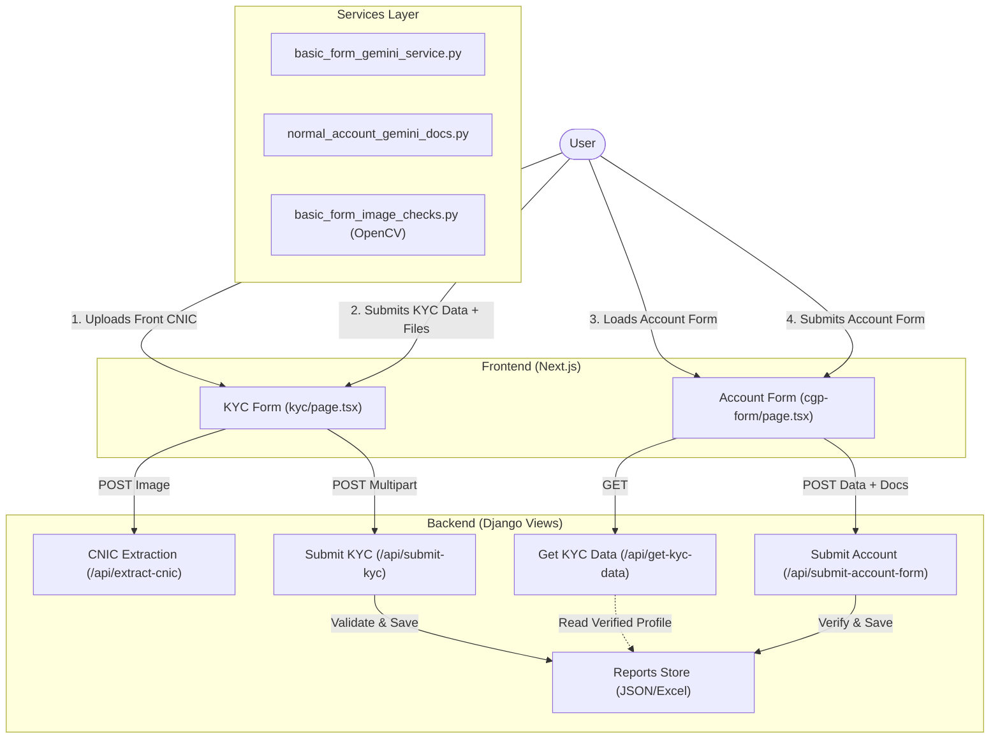

# Youngs Capital - Account Opening System

This repository contains the full stack implementation for the Youngs Capital KYC and Account Opening digital flow.

## 🚀 Quick Start

### Prerequisites
- Python 3.10+
- Node.js 18+
- Gemini API Key

### 1. Backend Setup (Django)
```bash
cd backend
# Create virtual env
python -m venv venv
# Activate (Windows)
venv\Scripts\activate
# Activate (Mac/Linux)
source venv/bin/activate

# Install requirements
pip install -r requirements.txt

# Run server (default port 8000)
python manage.py runserver
```

### 2. Frontend Setup (Next.js)
```bash
cd frontend
# Install dependencies
npm install

# Run dev server (default port 3000)
npm run dev
```

---

## 🏗️ Architecture Overview

The system follows a 2-step verification process: **Level 1 (KYC)** using specialized OCR/Match logic, followed by **Level 2 (Account Form)** which consumes the verified KYC profile and adds documents verified by Gemini.

### High-Level Flow


---

## 📚 Backend Technical Reference

### Active Endpoints (`api/views.py`)
| Endpoint | Method | Description |
| :--- | :--- | :--- |
| `/api/extract-cnic` | POST | Extracts text from CNIC front image using Gemini. |
| `/api/submit-kyc` | POST | **Level 1 Verification.** Validates Image Quality, CNIC details, IBAN Proof, and Relationship. Saves `verified_{kyc_id}.json`. |
| `/api/get-kyc-data` | GET | Fetches `verified_{kyc_id}.json` to auto-fill the main Account Form. |
| `/api/submit-account-form` | POST | **Level 2 Account Opening.** Validates 9+ documents (Income, Employment, etc.) using `gemini_check_document`. |

### Key Services

#### 1. `api/services/basic_form_gemini_service.py`
Handles specific field extraction tasks for KYC.
*   **`extract_cnic_with_gemini`**: Extract CNIC details + Tamper Check.
*   **`extract_iban_with_gemini`**: Verifies IBAN doc type and "Computer Generated" wording check.
*   **`extract_relationship_with_gemini`**: Verifies Affidavit/Undertaking for name matching.

#### 2. `api/services/normal_account_gemini_docs.py`
Generalized engine for verifying variable document types in the Account Form.
*   **`gemini_check_document`**: Dynamically generates prompts based on `doc_type` (e.g., checking 90-day recency for Proof of Address, checking Stamp/Signature (active) for Proof of Income).

#### 3. `api/services/cnic_extraction_service.py`
Dedicated OCR utilities.
*   **`extract_cnic_details`**: High-level extractor for the initial "Scan CNIC" feature.
*   **`extract_cnic_back_details`**: Extracts and translates (Urdu->English) addresses from CNIC back.

### Deprecated Files (Safe to Ignore)
These files are present but **NOT** used in the active flow:
*   `api/services/normal_account_compare.py`
*   `api/services/normal_account_docs_service.py`
*   `api/services/normal_account_gemini_form.py`
*   `api/services/pdf_report_generator.py`

---

## 🖥️ Frontend Overview

The frontend is built with **Next.js 16** and **TailwindCSS v4**.

### Key Pages
*   **`app/open-account/kyc/page.tsx`**: The entry point. Handles the "Scan CNIC" interaction, camera capture, and Level 1 form submission.
*   **`app/cgp-form/page.tsx`**: The main account opening form. Auto-fills data from KYC, handles massive form state, and conditional document uploads (Nominee, Attorney, Zakat).

### Components
*   **`components/Input.tsx`**: Reusable input components with error state styling (Red borders).
*   **Camera Integration**: Uses standard HTML5 MediaDevices API for capturing CNIC images directly in browser.
